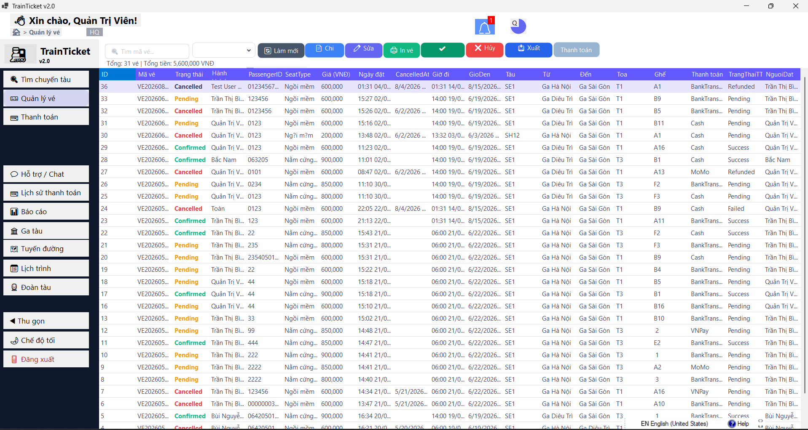

<div align="center">

# 🚂 TrainTicket System

**Hệ thống đặt vé tàu hỏa desktop đa vùng — xây dựng bằng C# .NET 8 & WinForms**

[](https://dotnet.microsoft.com/)
[](https://learn.microsoft.com/en-us/dotnet/csharp/)
[](https://www.microsoft.com/sql-server)
[](./TrainTicket.sln)
[](LICENSE)

> Ứng dụng quản lý và đặt vé tàu hỏa desktop quy mô lớn, hỗ trợ **4 vùng cơ sở dữ liệu độc lập**, phân quyền **3 cấp**, tích hợp **QR thanh toán VietQR**, chat nội bộ real-time và báo cáo doanh thu trực quan.



</div>

---

## 📋 Mục lục

- [Tính năng nổi bật](#-tính-năng-nổi-bật)
- [Kiến trúc hệ thống](#️-kiến-trúc-hệ-thống)
- [Công nghệ sử dụng](#-công-nghệ-sử-dụng)
- [Cấu trúc project](#-cấu-trúc-project)
- [Hướng dẫn cài đặt](#-hướng-dẫn-cài-đặt)
- [Phân quyền người dùng](#-phân-quyền-người-dùng)
- [Luồng nghiệp vụ chính](#-luồng-nghiệp-vụ-chính)
- [Cơ sở dữ liệu](#️-cơ-sở-dữ-liệu)
- [Kiểm thử](#-kiểm-thử)
- [Tác giả](#-tác-giả)

---

## ✨ Tính năng nổi bật

### 🎫 Đặt vé & Thanh toán
- **Tìm chuyến tàu** theo ga đi / ga đến / ngày khởi hành (gọi Stored Procedure `sp_TimChuyenTau`)
- **Sơ đồ ghế tương tác** — hiển thị trạng thái từng ghế theo toa, chọn ghế với slide animation mượt mà
- **Đặt vé đa hành khách** qua Stored Procedure có xử lý race condition (XLOCK + ROWLOCK)
- **Thanh toán QR VietQR** — tự động tạo mã QR ngân hàng với số tiền đúng theo vé
- **Chính sách hoàn tiền tự động** khi hủy vé (100% nếu còn ≥ 24h, 50% nếu còn 2–24h)
- **Áp dụng mã giảm giá** theo phần trăm / số tiền cố định, kiểm soát ngày hết hạn và giới hạn lượt dùng
- **Xuất vé & In vé** trực tiếp từ ứng dụng

### 👥 Quản lý & Vận hành
- **Check-in hành khách** theo mã vé (`sp_CheckIn`)
- **Quản lý lịch trình** — cập nhật trạng thái, delay, hủy chuyến
- **Quản lý danh mục**: Tàu, Nhà ga, Tuyến đường, Lịch trình, Toa tàu, Ghế ngồi
- **Lịch sử thanh toán** với bộ lọc đa chiều (phương thức, trạng thái, từ khóa)
- **Thanh toán tại quầy** — Staff xác nhận thanh toán tiền mặt trực tiếp

### 📊 Báo cáo & Thống kê
- **Báo cáo doanh thu** theo năm / tháng / tuyến đường (gọi SP `sp_BaoCaoDoanhThu`)
- **Biểu đồ cột trực quan** với `System.Windows.Forms.DataVisualization.Charting`
- **Xuất Excel** định dạng chuyên nghiệp với tiêu đề, lọc dữ liệu, căn lề tự động (ClosedXML)
- **Dashboard Admin** — tổng quan số liệu ngày hôm nay (vé bán / doanh thu / người dùng / tàu hoạt động)
- **Dashboard Customer** — thống kê vé cá nhân và tổng chi tiêu

### 💬 Chat & Thông báo
- **Chat nội bộ real-time** (polling mỗi 5 giây, `SemaphoreSlim` tránh race condition UI)
- **Bubble chat UI** tự động cuộn xuống tin mới, responsive khi resize
- **Hệ thống thông báo** với badge đếm số chưa đọc, auto-refresh mỗi 60 giây

### 🎨 Giao diện
- **Dark / Light Mode** — lưu lựa chọn vào `LocalApplicationData`
- **Toast notification queue** — không bị chồng chéo khi có nhiều thông báo liên tiếp
- **Loading overlay** bán trong suốt cho tất cả tác vụ async
- **Fade-in / Fade-out animation** khi mở/đóng Form đăng nhập
- **Slide panel animation** trên màn hình chọn ghế
- **Material Design 3** — palette Indigo-500 + Amber-500, Guna UI2 components

---

## 🏗️ Kiến trúc hệ thống

```
┌─────────────────────────────────────────────────────────┐
│                  TrainTicket.WinForms                    │
│  ┌──────────────┐  ┌────────────┐  ┌──────────────────┐ │
│  │    Forms     │  │  Helpers   │  │    Program.cs    │ │
│  │  (19 forms)  │  │  UiTheme   │  │  DI Container    │ │
│  │              │  │  Session   │  │  ServiceProvider │ │
│  └──────┬───────┘  └────────────┘  └──────────────────┘ │
└─────────┼───────────────────────────────────────────────┘
          │ calls via Interface
┌─────────▼───────────────────────────────────────────────┐
│                 TrainTicket.Business                     │
│  ┌─────────────┐  ┌────────────┐  ┌─────────────────┐  │
│  │  Services   │  │ Interfaces │  │   Constants     │  │
│  │ AuthService │  │  ITicket   │  │  RoleNames      │  │
│  │TicketService│  │ ISchedule  │  │  TicketStatus   │  │
│  │ReportService│  │  IReport   │  │                 │  │
│  └──────┬──────┘  └────────────┘  └─────────────────┘  │
└─────────┼───────────────────────────────────────────────┘
          │ EF Core + ADO.NET
┌─────────▼───────────────────────────────────────────────┐
│                   TrainTicket.Data                       │
│  ┌─────────────┐  ┌────────────┐  ┌─────────────────┐  │
│  │  DbContexts │  │    ADO     │  │   Entities      │  │
│  │  EF Core    │  │ AdoHelper  │  │  (21 entities)  │  │
│  │  DbContext  │  │ConnectionH │  │                 │  │
│  └─────────────┘  └────────────┘  └─────────────────┘  │
└─────────────────────────┬───────────────────────────────┘
                          │
          ┌───────────────▼──────────────────┐
          │         SQL Server               │
          │  ┌──────┬───────┬───────┬──────┐ │
          │  │  HQ  │ North │Central│ South│ │
          │  └──────┴───────┴───────┴──────┘ │
          └──────────────────────────────────┘
```

> **Hybrid Data Access Strategy**: Dùng **EF Core** cho CRUD danh mục đơn giản.  
> Dùng **ADO.NET + Stored Procedures** cho nghiệp vụ phức tạp (đặt vé, báo cáo, check-in) — đảm bảo hiệu năng cao và toàn vẹn dữ liệu với transaction cấp DB.

---

## 🛠️ Công nghệ sử dụng

| Thành phần | Công nghệ | Phiên bản |
|-----------|-----------|-----------|
| Ngôn ngữ | C# | 12.0 |
| Framework | .NET | 8.0 |
| UI Framework | Windows Forms + Guna UI2 | 2.0.4.7 |
| ORM | Entity Framework Core | 8.0.11 |
| Database | Microsoft SQL Server | 2019+ |
| Raw SQL | ADO.NET (`SqlConnection`, `SqlCommand`) | — |
| DI Container | `Microsoft.Extensions.DependencyInjection` | 10.0.7 |
| Password Hashing | BCrypt.Net-Next | 4.1.0 |
| Excel Export | ClosedXML | 0.105.0 |
| Charts | System.Windows.Forms.DataVisualization | 1.0.0 |
| QR Code | QRCoder + VietQR API | 1.8.0 |
| Serialization | System.Text.Json | built-in |

---

## 📁 Cấu trúc project

```
TrainTicket/
├── 📂 TrainTicket.Data/              # Tầng dữ liệu
│   ├── ADO/
│   │   ├── AdoHelper.cs              # Wrapper thực thi Stored Procedure & raw SQL
│   │   └── ConnectionHelper.cs       # Quản lý chuỗi kết nối đa vùng
│   ├── DbContexts/
│   │   └── TrainTicketDbContext.cs   # EF Core DbContext + Global Query Filter
│   ├── Entities/                     # 21 entity class ánh xạ bảng DB
│   ├── Helpers/
│   │   └── RegionHelper.cs           # Hằng số vùng HQ/North/Central/South
│   ├── Repositories/
│   │   ├── IRepository.cs            # Generic repository interface
│   │   └── EfRepository.cs           # Generic CRUD implementation
│   └── DataSeeder.cs                 # Tự động tạo DB, Roles, Admin, Stored Procedures
│
├── 📂 TrainTicket.Business/          # Tầng nghiệp vụ
│   ├── Constants/
│   │   ├── RoleNames.cs              # Admin / Staff / Customer
│   │   └── TicketStatus.cs           # Pending / Confirmed / Used / Cancelled
│   ├── DTOs/                         # Data Transfer Objects
│   ├── Interfaces/                   # 10 service interfaces
│   └── Services/
│       ├── AuthService.cs            # Đăng nhập, đăng ký, đổi mật khẩu (BCrypt)
│       ├── TicketService.cs          # Đặt vé, hủy vé, check-in, thanh toán
│       ├── ScheduleService.cs        # Tìm chuyến, sơ đồ ghế
│       ├── ReportService.cs          # Báo cáo doanh thu, top tuyến
│       ├── CatalogService.cs         # CRUD: Tàu, Ga, Tuyến, Lịch trình
│       ├── ChatService.cs            # Chat nội bộ real-time
│       ├── DashboardService.cs       # Thống kê Admin & Customer
│       ├── DiscountService.cs        # Mã giảm giá
│       ├── NotificationService.cs    # Thông báo
│       └── CustomerService.cs        # Hồ sơ khách hàng
│
├── 📂 TrainTicket.WinForms/          # Tầng giao diện
│   ├── Forms/                        # 19 form giao diện
│   │   ├── frmLogin_new              # Đăng nhập (fade animation, multi-region)
│   │   ├── frmMain_New               # Shell chính (sidebar, routing, phân quyền)
│   │   ├── frmSearch_new             # Tìm chuyến tàu
│   │   ├── frmSeatMap_New            # Sơ đồ ghế (slide panel animation)
│   │   ├── frmBookingConfirm_New     # Xác nhận đặt vé (validation đầy đủ)
│   │   ├── frmPayments_New           # Thanh toán QR VietQR
│   │   ├── frmTickets_New            # Quản lý vé (check-in, hủy, xuất CSV)
│   │   ├── frmReports_New            # Báo cáo + biểu đồ + xuất Excel
│   │   ├── frmChat_New               # Chat real-time
│   │   ├── frmCustomerDashboard_New  # Dashboard khách hàng
│   │   └── ...                       # Trains, Stations, Routes, Schedules, ...
│   ├── Helpers/
│   │   ├── SessionManager.cs         # Quản lý phiên đăng nhập (timeout 8h)
│   │   ├── UiTheme.cs                # Dark/Light mode, Material Design palette
│   │   ├── UiNotifier.cs             # Toast notification queue
│   │   ├── LoadingOverlay.cs         # Loading overlay component tái sử dụng
│   │   ├── GlobalExceptionHandler.cs # Bắt lỗi toàn cục, ghi log ra file
│   │   └── TenantProvider.cs         # Cung cấp vùng DB hiện tại cho EF Core
│   └── Program.cs                    # DI Container, Application entry point
│
├── 📂 Tests/                         # Kiểm thử
│   ├── AutomatedTest.sql             # Integration test 3 luồng nghiệp vụ chính
│   ├── TrainTicket_ManualTestCase.xlsx
│   └── TrainTicket_TestReport_QA.docx
│
└── DTBTRAINTICKET.sql                # Script khởi tạo toàn bộ Database
```

---

## 🚀 Hướng dẫn cài đặt

### Yêu cầu hệ thống
- Windows 10/11 (64-bit)
- [.NET 8.0 SDK](https://dotnet.microsoft.com/download/dotnet/8.0)
- Microsoft SQL Server 2019+ (hoặc Express)
- Visual Studio 2022 (Community trở lên)

### Các bước cài đặt

**1. Clone repository**
```bash
git clone https://github.com/your-username/TrainTicket.git
cd TrainTicket
```

**2. Khởi tạo Database**

Mở **SQL Server Management Studio**, chạy file:
```
DTBTRAINTICKET.sql
```
> Script này tạo đầy đủ: Tables, Views, Stored Procedures, Functions và dữ liệu seed.

**3. Cấu hình kết nối**

Mở `TrainTicket.Data/ADO/ConnectionHelper.cs` và chỉnh sửa connection string:
```csharp
public static string DefaultConnection =>
    "Server=YOUR_SERVER;Database=TrainTicketDB;Trusted_Connection=True;TrustServerCertificate=True;";
```

**4. Build & Chạy**
```bash
dotnet build TrainTicket.sln
dotnet run --project TrainTicket.WinForms
```
Hoặc nhấn **F5** trong Visual Studio 2022.

### Tài khoản mặc định

| Role | Email | Mật khẩu |
|------|-------|----------|
| Admin | `admin@trainticket.vn` | `Admin@123` |
| Staff | Tạo trong ứng dụng | — |
| Customer | Đăng ký tại màn hình Login | — |

---

## 🔐 Phân quyền người dùng

```
┌─────────────────────────────────────────────────────────────┐
│                         ADMIN                               │
│  ✓ Tất cả tính năng của Staff                              │
│  ✓ Quản lý: Tàu, Nhà ga, Tuyến đường, Lịch trình          │
│  ✓ Xem báo cáo doanh thu & lịch sử thanh toán             │
│  ✓ Xuất Excel báo cáo                                      │
├─────────────────────────────────────────────────────────────┤
│                         STAFF                               │
│  ✓ Xem & quản lý tất cả vé tàu                            │
│  ✓ Check-in hành khách lên tàu                             │
│  ✓ Xác nhận thanh toán tiền mặt tại quầy                  │
│  ✓ Chat hỗ trợ khách hàng                                  │
├─────────────────────────────────────────────────────────────┤
│                       CUSTOMER                              │
│  ✓ Tìm và đặt vé tàu                                      │
│  ✓ Thanh toán QR / Tiền mặt                               │
│  ✓ Xem & hủy vé của mình                                  │
│  ✓ Chat với nhân viên hỗ trợ                               │
│  ✓ Xem Dashboard cá nhân & lịch sử chi tiêu               │
└─────────────────────────────────────────────────────────────┘
```

---

## 🔄 Luồng nghiệp vụ chính

```
[CUSTOMER]
    │
    ├─► Tìm chuyến tàu ──► Chọn ghế ──► Nhập thông tin hành khách
    │                                             │
    │                          ┌──────────────────▼────────────────────┐
    │                          │           Chọn thanh toán             │
    │                          │  Tiền mặt    │    Chuyển khoản/QR    │
    │                          │  → Pending   │    → QR VietQR sinh   │
    │                          │  → Staff     │    → Nhập mã GD       │
    │                          │    xác nhận  │    → Confirmed ngay   │
    │                          └──────────────────────────────────────┘
    │                                             │
    │                                    [Ticket: Confirmed]
    │
    └─► Hủy vé?
          Còn ≥ 24h  →  Hoàn 100% tiền
          Còn 2–24h  →  Hoàn 50% tiền
          Còn < 2h   →  Không hoàn tiền
```

---

## 🗄️ Cơ sở dữ liệu

### Stored Procedures chính

| Stored Procedure | Mô tả |
|----------------|-------|
| `sp_DatVe` | Đặt vé — bảo vệ race condition với XLOCK + ROWLOCK + UPDLOCK |
| `sp_HuyVe` | Hủy vé — tự tính refund theo chính sách thời gian |
| `sp_XacNhanThanhToan` | Xác nhận thanh toán, cập nhật trạng thái vé & payment |
| `sp_CheckIn` | Check-in hành khách lên tàu |
| `sp_TimChuyenTau` | Tìm chuyến theo ga đi, ga đến, ngày khởi hành |
| `sp_XemSoDoGhe` | Lấy sơ đồ ghế + trạng thái đặt chỗ của lịch trình |
| `sp_BaoCaoDoanhThu` | Báo cáo doanh thu theo năm/tháng/tuyến đường |

### Đa vùng Database (Multi-Region)

Hệ thống hỗ trợ 4 server độc lập — người dùng chọn vùng khi đăng nhập:

| Vùng | Màu nhận diện | Mô tả |
|------|-------------|-------|
| 🔘 HQ | Xám | Trụ sở chính (mặc định) |
| 🟢 North | Xanh lá | Chi nhánh miền Bắc |
| 🟡 Central | Vàng cam | Chi nhánh miền Trung |
| 🔵 South | Xanh dương | Chi nhánh miền Nam |

### Sơ đồ quan hệ (tóm tắt)

```
Users ──────── UserRoles ─── Roles
  │
  ├── Tickets ─── Payments
  │       └────── Schedules ─── Routes ─── Stations
  │                    └──────── Trains ─── Carriages ─── Seats
  │
  ├── Discounts
  ├── ChatMessages
  └── Notifications
```

---

## 🧪 Kiểm thử

### Integration Test (Automated SQL)

File [`Tests/AutomatedTest.sql`](Tests/AutomatedTest.sql) kiểm thử tự động 3 luồng nghiệp vụ cốt lõi bằng T-SQL:

| Test Case | Stored Procedure | Kết quả mong đợi |
|-----------|-----------------|-----------------|
| TC1 — Đặt vé | `sp_DatVe` | Ticket `Pending` + Payment `Pending` |
| TC2 — Thanh toán | `sp_XacNhanThanhToan` | Ticket `Confirmed` + Payment `Success` |
| TC3 — Hủy vé | `sp_HuyVe` | Ticket `Cancelled` + Payment `Refunded` |

Chạy trực tiếp trong **SSMS** — output mong đợi:
```
=== BẮT ĐẦU KIỂM THỬ TỰ ĐỘNG (INTEGRATION TEST) ===
>> OK Đặt vé thành công! Tickets (Pending) - Payments (Pending). TicketID: 42
>> OK Thanh toán thành công! Tickets (Confirmed) - Payments (Success).
>> OK Hủy vé thành công! Tickets (Cancelled) - Payments (Refunded).
=== HOÀN TẤT KIỂM THỬ THÀNH CÔNG ===
```

### Manual Test Cases
Xem [`Tests/TrainTicket_ManualTestCase.xlsx`](Tests/TrainTicket_ManualTestCase.xlsx) — bao gồm test cases cho tất cả chức năng với dữ liệu mẫu và kết quả mong đợi.

### Race Condition Test
`sp_DatVe` được bảo vệ bằng `XLOCK` + `ROWLOCK` + `UPDLOCK` — đảm bảo không thể đặt trùng ghế dù 2 request đến đồng thời trong môi trường concurrent.

### Build Status
```
Build succeeded.
    0 Warning(s)
    0 Error(s)
```

---

## 💡 Điểm kỹ thuật nổi bật

| Kỹ thuật | Chi tiết |
|---------|---------|
| **Dependency Injection** | `Microsoft.Extensions.DependencyInjection` — Services và Forms đều resolve qua DI, không `new` thủ công |
| **Async/Await** | Toàn bộ tác vụ IO bất đồng bộ, không block UI thread |
| **SemaphoreSlim** | Chat polling dùng `SemaphoreSlim(1,1)` tránh race condition khi render bubble |
| **Global Query Filter** | EF Core lọc dữ liệu theo `Region` tự động qua `ITenantProvider` — Forms không cần quan tâm đến vùng |
| **Hybrid Data Access** | EF Core + ADO.NET kết hợp theo đúng use case — tối ưu cả năng suất phát triển lẫn hiệu năng |
| **Scope Management** | `IServiceScope` dispose đúng cách trong `frmMain_New` mỗi khi chuyển form — không memory leak |
| **Global Exception Handler** | Bắt toàn bộ exception (UI thread + background thread), ghi log file, app không crash |
| **BCrypt** | Mật khẩu hash với work factor 11, không lưu plaintext |
| **Multi-Region DB** | Đổi `ConnectionHelper.CurrentConnectionString` runtime, EF và ADO đều tự cập nhật |
| **Toast Queue** | `UiNotifier` xếp hàng toast — không overlap khi nhiều thông báo đến cùng lúc |

---

## 👨‍💻 Tác giả

**Vũ Lưu Minh Toàn**

[](https://github.com/minhtoanvu)

---

<div align="center">

**⭐ Nếu project này hữu ích, hãy cho một Star nhé!**

*Made with ❤️ using C# .NET 8 & Windows Forms*

</div>
